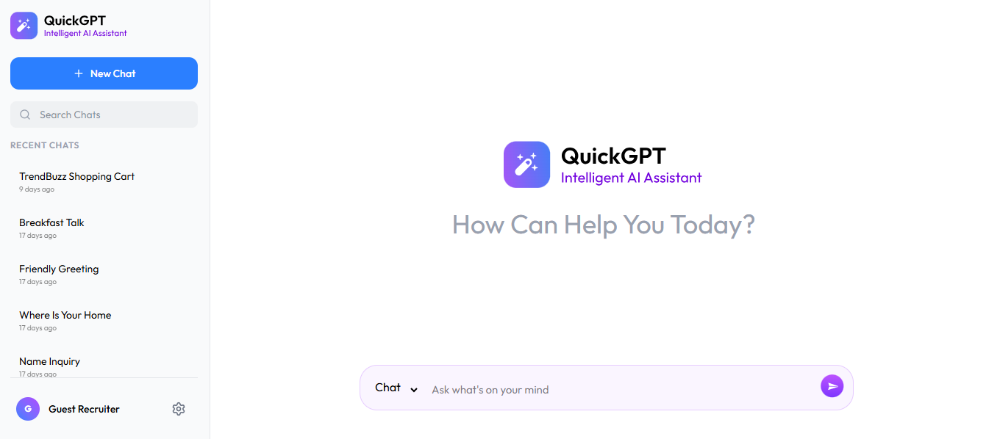
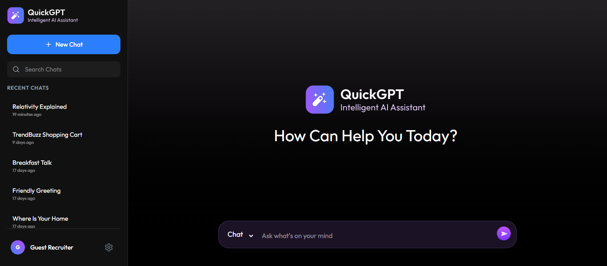
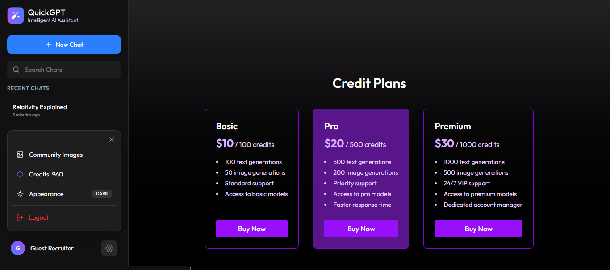
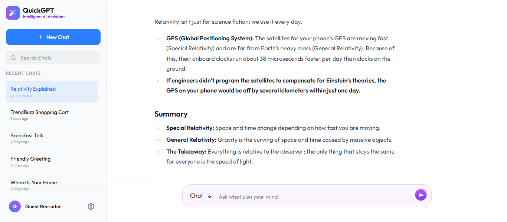
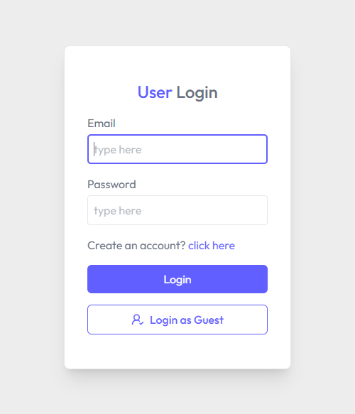
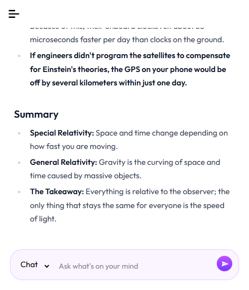

# 🚀 Quick-GPT - AI Powered Chat & Image Generation App

Quick-GPT is a full-stack AI application built with the **MERN** stack, featuring real-time AI chatting and image generation capabilities. It includes a robust authentication system, credit-based usage, and a sleek dark/light mode UI.

---

## 🌐 Live Demo
- **Frontend:** [https://shahadat-quick-gpt.netlify.app](https://shahadat-quick-gpt.netlify.app)
- **Backend:** [https://quick-gpt-server-qbhl.onrender.com](https://quick-gpt-server-qbhl.onrender.com)

> **Note:** The server is hosted on a free Render tier. If it's inactive, please allow **30-60 seconds** for the initial "cold start."

---

## 📸 Screenshots

### ☀️ Light Mode


### 🌙 Dark Mode


### 🌙 Dark Mode


### ☀️ Light Mode




### Responsive View


---

## ✨ Key Features

- **🔐 Advanced Auth:** Secure Register/Login with email activation and Guest Login for quick access.
- **💬 AI Chatbot:** Real-time conversational AI with message history persistence using MongoDB.
- **🖼️ Image Generation:** AI-powered image creation (Integration in progress).
- **💳 Credit System:** Users get limited credits per day/account to interact with the AI.
- **🌓 UI/UX:** Fully responsive design with **Dark/Light Mode** support and smooth animations.
- **⚡ Performance:** Optimized state management with **React Query** for seamless data fetching and caching.

---

## 🧠 Challenges & Learnings

### ⚡ Mastering Server-State with React Query
This was my first time using **TanStack Query (React Query)**, and it significantly improved how I handle server data. 
- **Mutations & Queries:** I learned to manage complex asynchronous states, such as using `useMutation` for chat interactions and `useQuery` for fetching chat history.
- **Cache Management:** Understanding how to invalidate queries and sync the cache after a new message or chat creation was a major learning curve that resulted in a much smoother UI.

### 🛡️ UX-Driven Error & Loading Handling
Instead of leaving the user in the dark during slow responses, I focused on high-quality UX:
- **Graceful Error Handling:** I implemented logic to catch API errors (like Gemini's rate limits) and display user-friendly notifications using **React Hot Toast**.
- **Cold Start Strategy:** To tackle Render's free tier "cold starts," I built a custom loading sequence that informs users about the server's status, preventing them from thinking the app is broken.

### 🔐 Secure Auth Flow & State Sync
Implementing a persistent authentication system that stays in sync with a global state was challenging. I learned to handle secure JWT flows and ensured that during logout, both the **Local State** and **React Query Cache** are completely cleared to maintain data privacy.

### 🌐 Monorepo Deployment & CORS
Configuring a monorepo (Frontend & Backend in one repo) for separate deployment platforms (Netlify & Render) taught me a lot about Environment Variables, CORS policies, and ensuring secure communication between cross-origin domains.

---

## 🛠️ Tech Stack

### Frontend
- **React.js** (Vite)
- **Tailwind CSS** (Styling)
- **React Query** (Server State Management)
- **Lucide React** (Icons)
- **React Hot Toast** (Notifications)

### Backend
- **Node.js & Express.js**
- **MongoDB & Mongoose** (Database)
- **Passport & JSON Web Token (JWT)** (Authentication)
- **CORS & Dotenv** (Security & Config)

---

## 📁 Project Structure (Monorepo)

```text
├── client/                # Frontend React application
│   ├── src/hooks/         # Custom hooks (Auth, Chat)
│   ├── src/components/    # Reusable UI components
│   └── ...
└── server/                # Backend Node.js API
    ├── models/            # MongoDB Schemas
    ├── routes/            # API Endpoints
    └── controllers/       # Business Logic
```

---
## 🚀 Installation & Local Setup

### 📋 Prerequisites
- **Node.js**: v18.x or higher
- **MongoDB**: Atlas account or local Compass
- **Git**: Installed on your machine

### 1. Clone the repository:
```bash
git clone https://github.com/muhammad-shahadat/quick-gpt
cd quick-gpt
```
### 2. Setup Backend
```bash
cd server
npm install
```
#### Create a .env file inside the server/ folder and add:
```bash

PORT=3000
MONGODB_URI= # -> your_mongodb_connection_string
NODE_ENV=development

#nodemailer verification system (optional).
SMTP_USERNAME=
SMTP_PASSWORD=
JWT_ACTIVATION_KEY=
JWT_ACCESS_KEY=
JWT_REFRESH_KEY=

CLIENT_URL= # -> frontend url
GEMINI_API_KEY= # -> your gemini api key
```
#### Then start the backend server:
```bash
npm start
```
### 3. Setup Frontend
#### Split terminal and run:
```bash
cd client
npm install
```
#### create a .env file (optional) and add: 
```bash
VITE_API_BASE_URL= # -> backend url
```
#### Then run the frontend:
```bash
npm run dev
```

---
## 🛠️ Troubleshooting

- **Server Delay (Cold Start):** As this project is hosted on Render's free tier, the first request might take **30-60 seconds** to wake up the server. Subsequent requests will be much faster.

- **AI Response Issues (Gemini API Rate Limit):** I am using the **Gemini Free API tier**, which has rate limits (RPM - Requests Per Minute). If the AI doesn't respond or shows an error, please wait a minute and try again. Occasionally, the free tier may experience downtime or high latency.

- **CORS Issues:** If you encounter CORS errors locally, verify that your `.env` file in the server directory has the correct `CLIENT_URL` (e.g., `http://localhost:5173`).

---
## 👨‍💻 Author
### Shahadat Hossain
- **GitHub:** [https://github.com/muhammad-shahadat](https://github.com/muhammad-shahadat)
- **Email:** [shahadat6640@gmail.com](mailto:shahadat6640@gmail.com)


---


